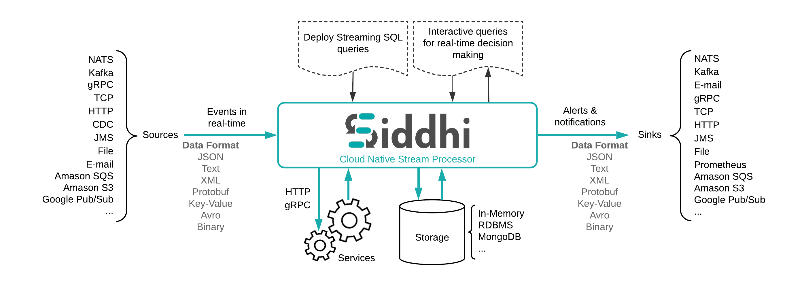
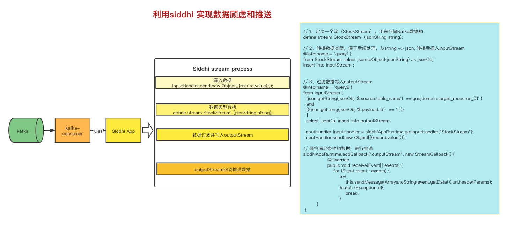

## 一、siddhi 相关资料链接:   
 Siddhi是一个轻量级的，简单的开源的复杂事件流程引擎。它使用类SQL的语言描述事件流任务，可以很好的支撑开发一个可扩展的，可配置的流式任务执行引擎。
 传统设计之中，为了支持不同的告警规则类型，我们需要编写不同的业务逻辑代码，但是使用了Siddhi之后，我们只需要配置不同的流任务Siddhiql，
 即可以支持不同的告警业务。
  
 为什么使用Siddhi：  
 它很快。UBER使用它每天处理 200 亿个事件（每秒 300,000 个事件）。    
 它是轻量级的(<2MB)，可嵌入到 Android 和 RaspberryPi 中。  
 它有超过 40 个Siddhi 扩展  
 它被60 多家公司使用，其中包括许多财富 500 强公司。以下是一些示例：    
 WSO2 将 Siddhi 用于以下目的：  
 在他们的产品中提供流处理能力，例如WSO2 Stream Processor。   
 作为WSO2 IoT Server的边缘分析库。     
 作为WSO2 API Manager节流的核心。    
 作为WSO2 产品分析的核心。   
 UBER 使用 Siddhi 进行欺诈分析。  
 Apache Eagle 使用 Siddhi 作为策略引擎。  
 基于 Siddhi 的解决方案已在 2014、2015、2016、2017 年的ACM DEBS 大挑战流处理比赛中入围。   
 Siddhi是许多学术研究项目的基础，被引用超过 60 次。     
 
### siddhi 架构图  


### 相关资料链接:  
 官网： https://siddhi.io/  
 查询语法： https://siddhi.io/en/v5.1/docs/query-guide/
 https://www.iteye.com/blog/shangboz-2429445  
 https://blog.csdn.net/qq_44242303/article/details/121150129  
 https://blog.csdn.net/mmayanshuo/article/details/108009904  
 
## 具体案例分析（数据推送-过滤）
 从上游Kafka中拉取数据，根据订阅的数据规则生成siddhi-sql进行查询过滤，最终推送至具体业务方  
 整体流程如下图： 
   
 
### kafka 数据结构:
```json
{
  "payload": {
    "id": 4,
    "create_time": null,
    "update_time": null,
    "name": 44
  },
  "key": "9eb79285c2d649fe8f2c85f63fa29e14",
  "source": {
    "version": "1.4.0.Final",
    "connector": "postgresql",
    "name": "jdbc_storage",
    "db": "jdbc_storage",
    "schema": "asd_cim",
    "table": "asd_0209",
    "txId": 1492299,
    "lsn": 797800384,
    "xmin": null,
    "src_type": "POSTGRESQL",
    "table_name": "domain.student"
  },
  "op": "c",
  "ts_ms": 1644393617031
}
```

### 前端配置规则：

```json
{"operator": "and", "sub_expression": [{"operator": "and", "sub_expression": [{"code": "id", "name": "主键", "value": "1", "compare": "eq"}]}]}
```
```json
{
    "dataPushMethodType":"POST",
    "dataPushUrl":"http://aa.com",
    "isEnable":false,
    "registerRuleList":{
        "operator":"and",
        "sub_expression":[
            {
                "operator":"and",
                "sub_expression":[
                    {
                        "operator":"and",
                        "sub_expression":[
                            {
                                "type":"property",
                                "code":"code",
                                "compare":"eq",
                                "value":"gyd"
                            },
                            {
                                "type":"property",
                                "code":"objectCode",
                                "compare":"eq",
                                "value":"abc"
                            }
                        ],
                        "root":true
                    },
                    {
                        "operator":"or",
                        "sub_expression":[
                            {
                                "type":"property",
                                "code":"deviceId",
                                "compare":"eq",
                                "value":"111"
                            },
                            {
                                "type":"property",
                                "code":"messageType",
                                "compare":"notEq",
                                "value":"abc"
                            }
                        ]
                    }
                ],
                "root":true
            }
        ]
    },
    "subscribeCode":"test-subscribe-rule",
    "subscribeName":"test-subscribe-rule",
    "domainCode":"ods",
    "resourceId":8812,
    "pullStrategy":"latest"
}
```

### 根据规则构造 siddhi-sql  
```text
private String getSiddhiSql(JSONObject ruleJson,PdcResource pdcResource) throws Exception {
        //根据资源类型拼接表名
        String tableName;
        String siddhiSql = "" +
                "define stream StockStream  (jsonString string);" +
                "" +
                "@info(name = 'query1') " +
                "from StockStream "+
                "select json:toObject(jsonString) as jsonObj "+
                "insert into InputStream ;"+
                "@info(name = 'query2') " +
                "from InputStream [(json:getString(jsonObj,'$.source.table_name')  =='"+
                tableName+
                "' )";
        if(ruleJson!=null && !ruleJson.isEmpty()){
            String conditionSql="and("+this.getSiddhiConditionSql(ruleJson,pdcResource)+")";
            siddhiSql=siddhiSql +conditionSql;
        }
        siddhiSql = siddhiSql+"] " +
                "select jsonObj "+
                "insert into outputStream;";
        return siddhiSql;
    }


    //拼接siddhisql
    private String getSiddhiConditionSql(JSONObject ruleJson,PdcResource pdcResource) throws Exception {
        StringBuffer sql=new StringBuffer();
        if(ruleJson.containsKey("operator")){
            JSONArray subConditions = ruleJson.getJSONArray("sub_expression");
//            Set<String> keySet = ruleJson.keySet();
//            List<String> keyList = new ArrayList<>();
//            keyList.addAll(keySet);
            int keyNumber=0;
            for(int i =0;i<subConditions.size();i++){
//                String key = keyList.get(i);
                JSONObject subCondition = (JSONObject)subConditions.get(i);
                if(subCondition.containsKey("operator")){
                    sql.append("(");
                    sql.append(this.getSiddhiConditionSql(subCondition,pdcResource));
                    sql.append(")");

                }else{
                    sql.append("(");
                    sql.append(this.buildSingleSql(subCondition,pdcResource));
                    sql.append(")");

                }
                if(keyNumber!=(subConditions.size()-1)){
                    sql.append(ruleJson.getString("operator"));
                }
                keyNumber++;
            }
        }else{
            return this.buildSingleSql(ruleJson,pdcResource);
        }
        return sql.toString();
    }


    public String buildSingleSql(JSONObject conditioJson,Resource pdcResource) throws Exception {
        StringBuffer sql= new StringBuffer();
        String key =conditioJson.getString("code");
        String operator =conditioJson.getString("compare");
        String value =conditioJson.getString("value");
        //获取数据集的字段类型
        Map<String,String> propertyDataTypeMap = this.getResourcePropertyDataType(pdcResource);
        //根据字段类型区分json的方法：getBool、getDouble、getFloat、getInt、getLong、getString、
        String jsonMethodType= SiddhiJsonMethodType.getJsonMethodType(propertyDataTypeMap.get(key));
        key="json:"+jsonMethodType+"(jsonObj,'$.payload."+key+"')";
        //value处理
        if(!StringUtils.isEmpty(value)){
            value=value.trim();
            value=value.replace("\"","").replace("\'","");
            //String类型的值需要增加单引号，其他类型不需要
            if(jsonMethodType.equals("getString")){
                value="'"+value+"'";
            }
        }
        SqlOperatorEnum sqlOperatorEnum=SqlOperatorEnum.getOperatorEnumByCode(operator);
        switch (sqlOperatorEnum){
            case NULL:
                sql.append(key).append(" ");
                sql.append(" is null ");
                break;
            case NOTNULL:
                sql.append(" not ");
                sql.append(key);
                sql.append(" is null ");
                break;
            case EQ:
                sql.append(key).append(" ");
                sql.append(" == ");
                sql.append(value).append(" ");
                break;
            case NOTEQ:
                sql.append(key).append(" ");
                sql.append(" != ");
                sql.append(value).append(" ");
                break;
            case GT:
                sql.append(key).append(" ");
                sql.append(" > ");
                sql.append(value).append(" ");
                break;
            case GTEQ:
                sql.append(key).append(" ");
                sql.append(" >= ");
                sql.append(value).append(" ");
                break;
            case LT:
                sql.append(key).append(" ");
                sql.append(" < ");
                sql.append(value).append(" ");
                break;
            case LTEQ:
                sql.append(key).append(" ");
                sql.append(" <= ");
                sql.append(value).append(" ");
                break;
            default:
                break;
        }
        return sql.toString();
    }
```

### 最终的siddhi-sql:
```text
define stream StockStream  (jsonString string);
@info(name = 'query1') from StockStream select json:toObject(jsonString) as jsonObj insert into InputStream ;
@info(name = 'query2') from 
		InputStream [
		(json:getString(jsonObj,'$.source.table_name')  =='domain.target_resource_01' )
		and
		(((json:getLong(jsonObj,'$.payload.id')  == 1 )))
		] 
		select jsonObj insert into outputStream;
```
		
### siddhi 处理流程讲解：
```text
// 1、定义一个流（StockStream），用来存储Kafka数据的define stream StockStream  (jsonString string);
// 2、转换数据类型，便于后续处理，从string -> json, 转换后插入InputStream
  @info(name = 'query1') 
  from StockStream select json:toObject(jsonString) as jsonObj insert into InputStream ;
 
 // 3、过滤数据写入outputStream
 @info(name = 'query2') 
 from InputStream [  (json:getString(jsonObj,'$.source.table_name')  =='gucjdomain.target_resource_01' )  and  (((json:getLong(jsonObj,'$.payload.id')  == 1 )))  ]   
 select jsonObj insert into outputStream; 
 
 // 4、数据来源往里放数
 InputHandler inputHandler = siddhiAppRuntime.getInputHandler("StockStream");  
 inputHandler.send(new Object[]{record.value()});

// 5、从过滤后的输出流中获取数据并推送
 siddhiAppRuntime.addCallback("outputStream", new StreamCallback() {
                @Override
                public void receive(Event[] events) {
                    //判断之前的处理是否有错误
                    if(haSendException[0] ==true){
                        log.info("之前已经抛出异常");
                        return;
                    }
                    for (Event event : events) {
                        //发送消息
                        try{
                            this.sendMessage(Arrays.toString(event.getData()),dataSubscribe.getDataPushUrl(),headerParams);
                        }catch (Exception e){
                            log.info("发送消息：{}，异常{}",event.getData(),e.getMessage());
                            break;
                        }
         }
 }
```	